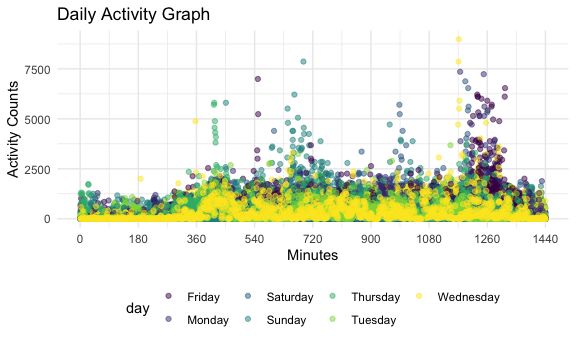
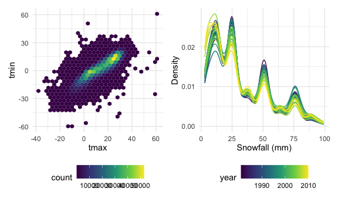

P8105 HW3
================
Jennifer Lee (UNI: jl2361)
2022-10-13

# Problem 1

We load the Instacart data from the p8105.datasets using:

``` r
library(p8105.datasets)
data("instacart")
```

The goal is to do some exploration of this dataset. To that end, write a
short description of the dataset, noting the size and structure of the
data, describing some key variables, and giving illstrative examples of
observations. Then, do or answer the following (commenting on the
results of each):

How many aisles are there, and which aisles are the most items ordered
from? Make a plot that shows the number of items ordered in each aisle,
limiting this to aisles with more than 10000 items ordered. Arrange
aisles sensibly, and organize your plot so others can read it. Make a
table showing the three most popular items in each of the aisles “baking
ingredients”, “dog food care”, and “packaged vegetables fruits”. Include
the number of times each item is ordered in your table. Make a table
showing the mean hour of the day at which Pink Lady Apples and Coffee
Ice Cream are ordered on each day of the week; format this table for
human readers (i.e. produce a 2 x 7 table).

# Problem 2

## Data description & cleaning

First, we load and tidy the data. The final dataset includes all
originally observed variables and values, has cleaned variable names,
includes a weekday vs weekend variable entitled `day_type`, converts
`min` from a character to numeric variable, rounds `activity_counts` to
whole numbers, and pivots the activity data from wide to long format.

``` r
accel_df = read_csv('data/accel_data.csv', show_col_types = FALSE) %>% 
  janitor::clean_names() %>%
  mutate(
    day_type = if_else(day == "Saturday", "weekend", if_else(day == "Sunday", "weekend", "weekday"))) %>%
      select(week, day_id, day, day_type, everything()) %>%
  pivot_longer(
    activity_1:activity_1440,
    names_to = "min", 
    names_prefix = "activity_",
    values_to = "activity_counts"
  ) %>%
  mutate(
    min = as.numeric(min),
    activity_counts = round(activity_counts, digits = 0)
  )

head(accel_df)
```

    ## # A tibble: 6 × 6
    ##    week day_id day    day_type   min activity_counts
    ##   <dbl>  <dbl> <chr>  <chr>    <dbl>           <dbl>
    ## 1     1      1 Friday weekday      1              88
    ## 2     1      1 Friday weekday      2              82
    ## 3     1      1 Friday weekday      3              64
    ## 4     1      1 Friday weekday      4              70
    ## 5     1      1 Friday weekday      5              75
    ## 6     1      1 Friday weekday      6              66

To briefly summarize, there are 50400 observations of activity counts
for each minute of each day across the 5 week study period. Our final
variables are: `week`, `day_id`, `day`, `day_type`, `min`, and
`activity_counts`.

Next, we aggregate across minutes to create a total activity variable
for each day entitled `total_daily_activity`, and create a table showing
these totals. We notice that there seems to be a trend towards lower
activity counts in the middle of the week (e.g. Tuesdays and
Wednesdays), but there is substantial variability per week. For example:
weeks 1-2, the highest activity counts seem to be recorded over the
weekend vs. week 3, the highest activity count seems to be recorded on
Monday vs. week 5, the highest activity counts seem to be recorded on
Thursday through Friday.

``` r
accel_df %>%
  group_by(week, day) %>%
  summarize(
    total_daily_activity = sum(activity_counts)
  ) %>%
  pivot_wider(
    names_from = "day", 
    values_from = "total_daily_activity"
  ) %>%
  select("week", "Saturday", "Sunday", "Monday", "Tuesday", "Wednesday", "Thursday", "Friday") %>%
knitr::kable() 
```

    ## `summarise()` has grouped output by 'week'. You can override using the
    ## `.groups` argument.

| week | Saturday | Sunday | Monday | Tuesday | Wednesday | Thursday | Friday |
|-----:|---------:|-------:|-------:|--------:|----------:|---------:|-------:|
|    1 |   376254 | 631105 |  78830 |  307103 |    340113 |   355948 | 480534 |
|    2 |   607175 | 422018 | 295431 |  423245 |    440962 |   474048 | 568839 |
|    3 |   382928 | 467052 | 685910 |  381507 |    468869 |   371230 | 467420 |
|    4 |     1440 | 260617 | 409450 |  319568 |    434460 |   340291 | 154049 |
|    5 |     1440 | 138421 | 389080 |  367824 |    445366 |   549658 | 620860 |

## Plot

**Here is a single-panel plot that shows the 24-hour activity time
courses for each day with color to indicate day of the week.** Based on
this graph, it appears that activity counts seem to be generally lower
during the middle of the week (i.e. Wednesdays) and higher on Fridays
and weekend days. There seem to be spikes in activity counts around
minutes 540, 720, 990, and 1260 when examining the activity data over
the course of a single day.

``` r
accel_df %>%
  ggplot(
    aes(x = min, y = activity_counts, color = day)) +
      geom_point(alpha = .5) +
  labs(title = "Daily Activity Graph",
       x = "Minutes",
       y = "Activity Counts") +
  scale_x_continuous(
    breaks = c(0, 180, 360, 540, 720, 900, 1080, 1260, 1440)
  ) 
```



# Problem 3

## Data description

We load the NY NOAA data from the p8105.datasets package and clean the
variable names.

``` r
library(p8105.datasets)
data("ny_noaa") 

noaa_df = ny_noaa %>%
  janitor::clean_names()
```

To briefly summarize, there are 2595176 rows / observations and 7
variables including:

-   `id`: weather station ID (character variable)
-   `date`: date of observation (date variable)
-   `prcp`: precipitation in tenths of mm (integer variable)
-   `snow`: snowfall in mm (integer variable)  
-   `snwd`: snow depth in mm (integer variable)
-   `tmax`: maximum temperature in tenths of degrees C (character
    variable, we will need to convert to a numerical variable)
-   `tmin`: minimum temperature in tenths of degrees C (character
    variable, we will need to convert to a numerical variable)

Using the `summary` function, we notice that there are a lot of missing
data in this dataset, particularly for the following variables: `prcp`,
`snow`, `snwd`. We cannot meaningfully comment on `tmin` and `tmax` in
the current state since they are assigned as character variables in the
original dataset, but a glance at the data with the `head` function
suggests that missing data is an issue with these variables too.

``` r
summary(noaa_df)
```

    ##       id                 date                 prcp               snow       
    ##  Length:2595176     Min.   :1981-01-01   Min.   :    0.00   Min.   :  -13   
    ##  Class :character   1st Qu.:1988-11-29   1st Qu.:    0.00   1st Qu.:    0   
    ##  Mode  :character   Median :1997-01-21   Median :    0.00   Median :    0   
    ##                     Mean   :1997-01-01   Mean   :   29.82   Mean   :    5   
    ##                     3rd Qu.:2005-09-01   3rd Qu.:   23.00   3rd Qu.:    0   
    ##                     Max.   :2010-12-31   Max.   :22860.00   Max.   :10160   
    ##                                          NA's   :145838     NA's   :381221  
    ##       snwd            tmax               tmin          
    ##  Min.   :   0.0   Length:2595176     Length:2595176    
    ##  1st Qu.:   0.0   Class :character   Class :character  
    ##  Median :   0.0   Mode  :character   Mode  :character  
    ##  Mean   :  37.3                                        
    ##  3rd Qu.:   0.0                                        
    ##  Max.   :9195.0                                        
    ##  NA's   :591786

``` r
head(noaa_df)
```

    ## # A tibble: 6 × 7
    ##   id          date        prcp  snow  snwd tmax  tmin 
    ##   <chr>       <date>     <int> <int> <int> <chr> <chr>
    ## 1 US1NYAB0001 2007-11-01    NA    NA    NA <NA>  <NA> 
    ## 2 US1NYAB0001 2007-11-02    NA    NA    NA <NA>  <NA> 
    ## 3 US1NYAB0001 2007-11-03    NA    NA    NA <NA>  <NA> 
    ## 4 US1NYAB0001 2007-11-04    NA    NA    NA <NA>  <NA> 
    ## 5 US1NYAB0001 2007-11-05    NA    NA    NA <NA>  <NA> 
    ## 6 US1NYAB0001 2007-11-06    NA    NA    NA <NA>  <NA>

## Data cleaning

We clean variable names; create separate variables for year, month, and
day and convert these to numeric variables; convert `tmax` and `tmin` to
numeric variables. In terms of units, we divide the temperature values
by 10 to convert units from tenths of degrees C to degrees C and divide
the precipitation values by 10 to convert units from tenths of mm to mm.

``` r
noaa_df = noaa_df %>%
  janitor::clean_names() %>%
  separate(col = date, into = c('year', 'month', 'day'), sep = "-") %>%
  mutate(
    tmax = as.numeric(tmax),
    tmin = as.numeric(tmin),
    year = as.numeric(year),
    month = as.numeric(month),
    day = as.numeric(day)) %>%
  mutate(
    tmax = tmax/10,
    tmin = tmin/10,
    prcp = prcp/10
  )

head(noaa_df)
```

    ## # A tibble: 6 × 9
    ##   id           year month   day  prcp  snow  snwd  tmax  tmin
    ##   <chr>       <dbl> <dbl> <dbl> <dbl> <int> <int> <dbl> <dbl>
    ## 1 US1NYAB0001  2007    11     1    NA    NA    NA    NA    NA
    ## 2 US1NYAB0001  2007    11     2    NA    NA    NA    NA    NA
    ## 3 US1NYAB0001  2007    11     3    NA    NA    NA    NA    NA
    ## 4 US1NYAB0001  2007    11     4    NA    NA    NA    NA    NA
    ## 5 US1NYAB0001  2007    11     5    NA    NA    NA    NA    NA
    ## 6 US1NYAB0001  2007    11     6    NA    NA    NA    NA    NA

To find the most commonly observed value or mode for snowfall, we create
a function to calculate the mode since R does not have a corresponding
built-in function. We then create another dataset entitled
`noaa_df_omit` where the missing data for snowfall are dropped, then
find the mode, which seems to be 0 mm. From this result, we gather that
mm may not be the most appropriate unit for snowfall and add a new
variable entitled `snow_inch` to convert mm into inches.

``` r
find_mode <- function(x) {
  u <- unique(x)
  tab <- tabulate(match(x, u))
  u[tab == max(tab)]
}

noaa_df_omit =
  noaa_df %>%
  drop_na(snow)

find_mode(pull(noaa_df_omit, snow))
```

    ## [1] 0

``` r
noaa_df = noaa_df %>%
  mutate(
    snow_inch = snow / 25.4
  ) %>%
  select(id, year, month, day, prcp, snow, snow_inch, everything())

head(noaa_df)
```

    ## # A tibble: 6 × 10
    ##   id           year month   day  prcp  snow snow_inch  snwd  tmax  tmin
    ##   <chr>       <dbl> <dbl> <dbl> <dbl> <int>     <dbl> <int> <dbl> <dbl>
    ## 1 US1NYAB0001  2007    11     1    NA    NA        NA    NA    NA    NA
    ## 2 US1NYAB0001  2007    11     2    NA    NA        NA    NA    NA    NA
    ## 3 US1NYAB0001  2007    11     3    NA    NA        NA    NA    NA    NA
    ## 4 US1NYAB0001  2007    11     4    NA    NA        NA    NA    NA    NA
    ## 5 US1NYAB0001  2007    11     5    NA    NA        NA    NA    NA    NA
    ## 6 US1NYAB0001  2007    11     6    NA    NA        NA    NA    NA    NA

## Plots

**Here is a two-panel plot showing the average max temperature in
January and in July in each station across years.** As expected, the
average tmax in January is generally lower compared to the average tmax
in July. There appears to be a lot of year-to-year and
station-to-station variability, which makes it challenging to make
conclusions.

In terms of outliers, 1994 and 2004 appear to have been unusually cold
in January (i.e. lower average tmax); there was one station in 1988 that
reported a much lower average tmax in July compared to other stations,
and 1984, 2000, 2004, and 2007 appear to have been unseasonably cooler
in July (i.e. lower average tmax).

``` r
january_averagetmax = 
  noaa_df %>%
  filter(month == "1") %>%
  group_by(year, month, id) %>%
  summarize(
    average_tmax = mean(tmax, na.rm = TRUE)) %>% 
ggplot( 
  aes(x = year, y = average_tmax, group = id)) +
  geom_line(alpha = .2) +
  labs(
    title = "January Average TMax",
    y = "Temperature (degrees C)") +
  theme(legend.position = "none") +
  scale_x_continuous(
    breaks = c(1980, 1982, 1984, 1986, 1988, 1990, 1992, 1994, 1996, 1998, 2000, 2002, 2004, 2006, 2008, 2010)) + 
  theme(axis.text.x = element_text(angle = 45, vjust = 1, hjust = 1))
```

    ## `summarise()` has grouped output by 'year', 'month'. You can override using the
    ## `.groups` argument.

``` r
july_averagetmax = 
  noaa_df %>%
  filter(month == "7") %>%
  group_by(year, month, id) %>%
  summarize(
    average_tmax = mean(tmax, na.rm = TRUE)) %>% 
ggplot( 
  aes(x = year, y = average_tmax, group = id)) +
  geom_line(alpha = .2) +
  labs(
    title = "July Average TMax",
    y = "Temperature (degrees C)") +
  theme(legend.position = "none") +
  scale_x_continuous(
    breaks = c(1980, 1982, 1984, 1986, 1988, 1990, 1992, 1994, 1996, 1998, 2000, 2002, 2004, 2006, 2008, 2010)) + 
  theme(axis.text.x = element_text(angle = 45, vjust = 1, hjust = 1))
```

    ## `summarise()` has grouped output by 'year', 'month'. You can override using the
    ## `.groups` argument.

``` r
january_averagetmax + july_averagetmax
```



**Here is a two-panel plot showing (i) tmax vs tmin for the full dataset
using a hexagonal heatmap; and (ii) the distribution of snowfall values
greater than 0 and less than 100 mm separately by year using a density
plot.**

``` r
tmax_tmin = 
  noaa_df %>%
  ggplot(
    aes(x = tmax, y = tmin)) + 
  geom_hex() + 
  labs(x = "TMax (degrees C)",
       y = "TMin (degrees C)") +
  theme(legend.text = element_text(size = 5))
 
snowfall = 
  noaa_df %>%
  filter(snow > 0, snow < 100) %>%
  ggplot(
    aes(x = snow, group = year, color = year)) +
      geom_density() +
  labs(x = "Snowfall (mm)",
       y = "Density")

tmax_tmin + snowfall
```


