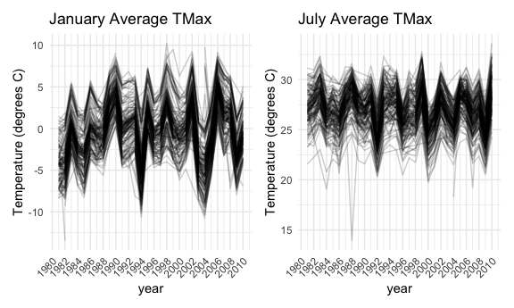

P8105 HW3
================
Jennifer Lee (UNI: jl2361)
2022-10-11

# Problem 1

We load the Instacart data from the p8105.datasets using:

``` r
library(p8105.datasets)
data("instacart")
```

The goal is to do some exploration of this dataset. To that end, write a
short description of the dataset, noting the size and structure of the
data, describing some key variables, and giving illstrative examples of
observations. Then, do or answer the following (commenting on the
results of each):

How many aisles are there, and which aisles are the most items ordered
from? Make a plot that shows the number of items ordered in each aisle,
limiting this to aisles with more than 10000 items ordered. Arrange
aisles sensibly, and organize your plot so others can read it. Make a
table showing the three most popular items in each of the aisles “baking
ingredients”, “dog food care”, and “packaged vegetables fruits”. Include
the number of times each item is ordered in your table. Make a table
showing the mean hour of the day at which Pink Lady Apples and Coffee
Ice Cream are ordered on each day of the week; format this table for
human readers (i.e. produce a 2 x 7 table).

# Problem 2

This problem uses five weeks of accelerometer data collected on a 63
year-old male with BMI 25, who was admitted to the Advanced Cardiac Care
Center of Columbia University Medical Center and diagnosed with
congestive heart failure (CHF). The data can be downloaded here. In this
spreadsheet, variables activity.\* are the activity counts for each
minute of a 24-hour day starting at midnight.

Load, tidy, and otherwise wrangle the data. Your final dataset should
include all originally observed variables and values; have useful
variable names; include a weekday vs weekend variable; and encode data
with reasonable variable classes. Describe the resulting dataset
(e.g. what variables exist, how many observations, etc).

``` r
accel_df = read_csv('data/accel_data.csv') %>% 
  janitor::clean_names() %>%
  mutate(
    day_type = if_else(day == "Saturday", "weekend", if_else(day == "Sunday", "weekend", "weekday"))) %>%
      select(week, day_id, day, day_type, everything()) %>%
  pivot_longer(
    activity_1:activity_1440,
    names_to = "min", 
    names_prefix = "activity_",
    values_to = "activity_counts"
  ) %>%
  mutate(
    min = as.numeric(min),
    activity_counts = round(activity_counts, digits = 0)
  )
```

    ## Rows: 35 Columns: 1443
    ## ── Column specification ────────────────────────────────────────────────────────
    ## Delimiter: ","
    ## chr    (1): day
    ## dbl (1442): week, day_id, activity.1, activity.2, activity.3, activity.4, ac...
    ## 
    ## ℹ Use `spec()` to retrieve the full column specification for this data.
    ## ℹ Specify the column types or set `show_col_types = FALSE` to quiet this message.

``` r
head(accel_df)
```

    ## # A tibble: 6 × 6
    ##    week day_id day    day_type   min activity_counts
    ##   <dbl>  <dbl> <chr>  <chr>    <dbl>           <dbl>
    ## 1     1      1 Friday weekday      1              88
    ## 2     1      1 Friday weekday      2              82
    ## 3     1      1 Friday weekday      3              64
    ## 4     1      1 Friday weekday      4              70
    ## 5     1      1 Friday weekday      5              75
    ## 6     1      1 Friday weekday      6              66

Traditional analyses of accelerometer data focus on the total activity
over the day. Using your tidied dataset, aggregate across minutes to
create a total activity variable for each day, and create a table
showing these totals. Are any trends apparent?

``` r
accel_df %>%
  group_by(week, day) %>%
  summarize(
    total_daily_activity = sum(activity_counts)
  ) %>%
knitr::kable()
```

    ## `summarise()` has grouped output by 'week'. You can override using the
    ## `.groups` argument.

| week | day       | total_daily_activity |
|-----:|:----------|---------------------:|
|    1 | Friday    |               480534 |
|    1 | Monday    |                78830 |
|    1 | Saturday  |               376254 |
|    1 | Sunday    |               631105 |
|    1 | Thursday  |               355948 |
|    1 | Tuesday   |               307103 |
|    1 | Wednesday |               340113 |
|    2 | Friday    |               568839 |
|    2 | Monday    |               295431 |
|    2 | Saturday  |               607175 |
|    2 | Sunday    |               422018 |
|    2 | Thursday  |               474048 |
|    2 | Tuesday   |               423245 |
|    2 | Wednesday |               440962 |
|    3 | Friday    |               467420 |
|    3 | Monday    |               685910 |
|    3 | Saturday  |               382928 |
|    3 | Sunday    |               467052 |
|    3 | Thursday  |               371230 |
|    3 | Tuesday   |               381507 |
|    3 | Wednesday |               468869 |
|    4 | Friday    |               154049 |
|    4 | Monday    |               409450 |
|    4 | Saturday  |                 1440 |
|    4 | Sunday    |               260617 |
|    4 | Thursday  |               340291 |
|    4 | Tuesday   |               319568 |
|    4 | Wednesday |               434460 |
|    5 | Friday    |               620860 |
|    5 | Monday    |               389080 |
|    5 | Saturday  |                 1440 |
|    5 | Sunday    |               138421 |
|    5 | Thursday  |               549658 |
|    5 | Tuesday   |               367824 |
|    5 | Wednesday |               445366 |

Accelerometer data allows the inspection activity over the course of the
day. Make a single-panel plot that shows the 24-hour activity time
courses for each day and use color to indicate day of the week. Describe
in words any patterns or conclusions you can make based on this graph.

``` r
accel_df %>%
  ggplot(
    aes(x = min, y = activity_counts, color = day)) +
      geom_point(alpha = .5) +
  labs(title = "Daily Activity Graph",
       x = "Hour (military time)",
       y = "Activity Counts") +
  scale_x_continuous(
    breaks = c(0, 180, 360, 540, 720, 900, 1080, 1260, 1440),
    labels = c("00:00", "03:00", "06:00", "09:00", "12:00", "15:00", "18:00", "21:00", "24:00")
  ) 
```


# Problem 3

We load the NY NOAA data from the p8105.datasets package using:

``` r
library(p8105.datasets)
data("ny_noaa") 
```

The goal is to do some exploration of this dataset. To that end, write a
short description of the dataset, noting the size and structure of the
data, describing some key variables, and indicating the extent to which
missing data is an issue. Then, do or answer the following (commenting
on the results of each):

Do some data cleaning. Create separate variables for year, month, and
day. Ensure observations for temperature, precipitation, and snowfall
are given in reasonable units. For snowfall, what are the most commonly
observed values? Why?

``` r
noaa_df = ny_noaa %>%
  janitor::clean_names() %>%
  separate(col = date, into = c('year', 'month', 'day'), sep = "-") %>%
  mutate(
    tmax = as.numeric(tmax),
    tmin = as.numeric(tmin),
    year = as.numeric(year),
    month = as.numeric(month),
    day = as.numeric(day)) %>%
  mutate(
    tmax = tmax/10,
    tmin = tmin/10,
    prcp = prcp/10
  )

head(noaa_df)
```

    ## # A tibble: 6 × 9
    ##   id           year month   day  prcp  snow  snwd  tmax  tmin
    ##   <chr>       <dbl> <dbl> <dbl> <dbl> <int> <int> <dbl> <dbl>
    ## 1 US1NYAB0001  2007    11     1    NA    NA    NA    NA    NA
    ## 2 US1NYAB0001  2007    11     2    NA    NA    NA    NA    NA
    ## 3 US1NYAB0001  2007    11     3    NA    NA    NA    NA    NA
    ## 4 US1NYAB0001  2007    11     4    NA    NA    NA    NA    NA
    ## 5 US1NYAB0001  2007    11     5    NA    NA    NA    NA    NA
    ## 6 US1NYAB0001  2007    11     6    NA    NA    NA    NA    NA

``` r
summary(noaa_df)
```

    ##       id                 year          month             day       
    ##  Length:2595176     Min.   :1981   Min.   : 1.000   Min.   : 1.00  
    ##  Class :character   1st Qu.:1988   1st Qu.: 4.000   1st Qu.: 8.00  
    ##  Mode  :character   Median :1997   Median : 7.000   Median :16.00  
    ##                     Mean   :1996   Mean   : 6.565   Mean   :15.73  
    ##                     3rd Qu.:2005   3rd Qu.:10.000   3rd Qu.:23.00  
    ##                     Max.   :2010   Max.   :12.000   Max.   :31.00  
    ##                                                                    
    ##       prcp              snow             snwd             tmax        
    ##  Min.   :   0.00   Min.   :  -13    Min.   :   0.0   Min.   :-38.9    
    ##  1st Qu.:   0.00   1st Qu.:    0    1st Qu.:   0.0   1st Qu.:  5.0    
    ##  Median :   0.00   Median :    0    Median :   0.0   Median : 15.0    
    ##  Mean   :   2.98   Mean   :    5    Mean   :  37.3   Mean   : 14.0    
    ##  3rd Qu.:   2.30   3rd Qu.:    0    3rd Qu.:   0.0   3rd Qu.: 23.3    
    ##  Max.   :2286.00   Max.   :10160    Max.   :9195.0   Max.   : 60.0    
    ##  NA's   :145838    NA's   :381221   NA's   :591786   NA's   :1134358  
    ##       tmin        
    ##  Min.   :-59.4    
    ##  1st Qu.: -3.9    
    ##  Median :  3.3    
    ##  Mean   :  3.0    
    ##  3rd Qu.: 11.1    
    ##  Max.   : 60.0    
    ##  NA's   :1134420

The statistical software R does not have a built-in function to
calculate the mode of a dataset, but we can use the following function
to calculate the mode:

``` r
find_mode <- function(x) {
  u <- unique(x)
  tab <- tabulate(match(x, u))
  u[tab == max(tab)]
}

noaa_df_omit =
  noaa_df %>%
  drop_na(snow)

find_mode(pull(noaa_df_omit, snow))
```

    ## [1] 0

Make a two-panel plot showing the average max temperature in January and
in July in each station across years. Is there any observable /
interpretable structure? Any outliers?

``` r
january_averagetmax = 
  noaa_df %>%
  group_by(month, id) %>%
  drop_na(tmax) %>%
  summarize(
    average_tmax = mean(tmax)) %>% 
  filter(month == "1") %>%
ggplot( 
  aes(x = id, y = average_tmax, color = id)) +
  geom_point(alpha = .5) +
  labs(
    title = "January Average TMax",
    y = "Temperature (degrees C)") +
  theme(legend.position = "none",
        axis.ticks.x = element_blank(),
        axis.text.x = element_blank(),
        axis.title.x = element_blank())
```

    ## `summarise()` has grouped output by 'month'. You can override using the
    ## `.groups` argument.

``` r
july_averagetmax = 
  noaa_df %>%
  group_by(month, id) %>%
  drop_na(tmax) %>%
  summarize(
    average_tmax = mean(tmax)) %>% 
  filter(month == "7") %>%
ggplot( 
  aes(x = id, y = average_tmax, color = id)) +
  geom_point(alpha = .5) +
  labs(
    title = "July Average TMax",
    caption = "Data from the rnoaa package. Each point represents a unique NY weather station.") +
  theme(legend.position = "none",
  axis.ticks.x = element_blank(),
  axis.text.x = element_blank(),
  axis.title.x = element_blank(),
  axis.title.y = element_blank())
```

    ## `summarise()` has grouped output by 'month'. You can override using the
    ## `.groups` argument.

``` r
january_averagetmax + july_averagetmax
```


Make a two-panel plot showing (i) tmax vs tmin for the full dataset
(note that a scatterplot may not be the best option); and (ii) make a
plot showing the distribution of snowfall values greater than 0 and less
than 100 separately by year.

``` r
tmax_tmin = 
  noaa_df %>%
  drop_na(c(tmax, tmin)) %>%
  ggplot(
    aes(x = tmax, y = tmin)) + 
  geom_hex() + 
  labs(x = "TMax (degrees C)",
       y = "TMin (degrees C)") +
  theme(legend.text = element_text(size = 5))
 
snowfall = 
  noaa_df %>%
  filter(snow > 0, snow < 100) %>%
  ggplot(
    aes(x = snow, group = year, color = year)) +
      geom_density() +
  labs(x = "Snowfall (mm)",
       y = "Density")

tmax_tmin + snowfall
```


