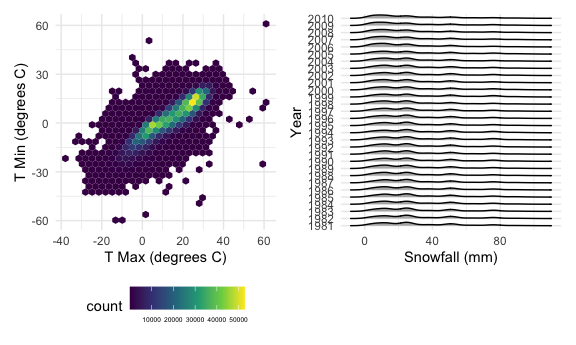

P8105 HW3
================
Jennifer Lee (UNI: jl2361)
2022-10-16

# Problem 1

## Data description

We load the Instacart data from the p8105.datasets.

``` r
data("instacart")

instacart =
  instacart %>%
  as_tibble(instacart)
```

This dataset contains 1384617 rows and 15 columns with each row
representing a single product from an instacart order. Variables include
identifiers for user, order, and product; the order in which each
product was added to the cart. There are also data describing the day
and time of the order, and number of days since prior order. There are
also several item-specific variables, describing the product name,
department, and aisle, and whether the item has been ordered by this
user in the past. In total, there are 39123 products found in 131209
orders from 131209 distinct users.

## Tables & Plots

Below is a table summarizing the number of items ordered from aisle. In
total, there are 134 aisles with fresh vegetables and fresh fruits
holding the most items ordered.

``` r
instacart %>%
  count(aisle) %>%
  arrange(desc(n))
```

    ## # A tibble: 134 × 2
    ##    aisle                              n
    ##    <chr>                          <int>
    ##  1 fresh vegetables              150609
    ##  2 fresh fruits                  150473
    ##  3 packaged vegetables fruits     78493
    ##  4 yogurt                         55240
    ##  5 packaged cheese                41699
    ##  6 water seltzer sparkling water  36617
    ##  7 milk                           32644
    ##  8 chips pretzels                 31269
    ##  9 soy lactosefree                26240
    ## 10 bread                          23635
    ## # … with 124 more rows

Next is a plot that shows the number of items ordered in each aisle.
Here, aisles are ordered by ascending number of items.

``` r
instacart %>%
  count(aisle) %>%
  filter(n > 10000) %>%
  mutate(aisle = fct_reorder(aisle, n)) %>%
  ggplot(aes(x = aisle, y = n)) +
  geom_point() +
  labs(title = "Number of items ordered in each aisle") +
  theme(axis.text.x = element_text(angle = 60, hjust = 1))
```


Our next table shows the three most popular items in aisles
`baking ingredients`, `dog food care`, and `packaged vegetables fruits`,
and includes the number of times each item is ordered.

``` r
instacart %>%
  filter(aisle %in% c("baking ingredients", "dog food care", "packaged vegetables fruits")) %>%
  group_by(aisle) %>%
  count(product_name) %>%
  mutate(rank = min_rank(desc(n))) %>%
  filter(rank < 4) %>%
  arrange(desc(n)) %>%
  knitr::kable()
```

| aisle                      | product_name                                  |    n | rank |
|:---------------------------|:----------------------------------------------|-----:|-----:|
| packaged vegetables fruits | Organic Baby Spinach                          | 9784 |    1 |
| packaged vegetables fruits | Organic Raspberries                           | 5546 |    2 |
| packaged vegetables fruits | Organic Blueberries                           | 4966 |    3 |
| baking ingredients         | Light Brown Sugar                             |  499 |    1 |
| baking ingredients         | Pure Baking Soda                              |  387 |    2 |
| baking ingredients         | Cane Sugar                                    |  336 |    3 |
| dog food care              | Snack Sticks Chicken & Rice Recipe Dog Treats |   30 |    1 |
| dog food care              | Organix Chicken & Brown Rice Recipe           |   28 |    2 |
| dog food care              | Small Dog Biscuits                            |   26 |    3 |

Finally, here is a table showing the mean hour of the day at which Pink
Lady Apples and Coffee Ice Cream are ordered on each day of the week.
This table has been formatted in an untidy manner for human readers.
Pink Lady Apples are generally purchased slightly earlier in the day
than Coffee Ice Cream, with the exception of day 5.

``` r
instacart %>%
  filter(product_name %in% c("Pink Lady Apples", "Coffee Ice Cream")) %>%
  group_by(product_name, order_dow) %>%
  summarize(mean_hour = mean(order_hour_of_day)) %>%
  spread(key = order_dow, value = mean_hour) %>%
  knitr::kable(digits = 2)
```

    ## `summarise()` has grouped output by 'product_name'. You can override using the
    ## `.groups` argument.

| product_name     |     0 |     1 |     2 |     3 |     4 |     5 |     6 |
|:-----------------|------:|------:|------:|------:|------:|------:|------:|
| Coffee Ice Cream | 13.77 | 14.32 | 15.38 | 15.32 | 15.22 | 12.26 | 13.83 |
| Pink Lady Apples | 13.44 | 11.36 | 11.70 | 14.25 | 11.55 | 12.78 | 11.94 |

# Problem 2

## Data description & cleaning

First, we load and tidy the data. The final dataset includes all
originally observed variables and values, has cleaned variable names,
includes a weekday vs weekend variable entitled `day_type`, converts
`min` from a character to numeric variable, rounds `activity_counts` to
whole numbers, and pivots the activity data from wide to long format.

``` r
accel_df = read_csv('data/accel_data.csv') %>% 
  janitor::clean_names() %>%
  mutate(
    day_type = if_else(day == "Saturday", "weekend", if_else(day == "Sunday", "weekend", "weekday")),
    day = fct_relevel(day, "Saturday", "Sunday", "Monday", "Tuesday", "Wednesday", "Thursday", "Friday")) %>%
  select(week, day_id, day, day_type, everything()) %>%
  pivot_longer(
    activity_1:activity_1440,
    names_to = "min", 
    names_prefix = "activity_",
    values_to = "activity_counts") %>%
  mutate(
    min = as.numeric(min),
    activity_counts = round(activity_counts, digits = 0)
  )
```

    ## Rows: 35 Columns: 1443
    ## ── Column specification ────────────────────────────────────────────────────────
    ## Delimiter: ","
    ## chr    (1): day
    ## dbl (1442): week, day_id, activity.1, activity.2, activity.3, activity.4, ac...
    ## 
    ## ℹ Use `spec()` to retrieve the full column specification for this data.
    ## ℹ Specify the column types or set `show_col_types = FALSE` to quiet this message.

To briefly summarize, there are 50400 observations of activity counts
for each minute of each day across the 5 week study period. Our final
variables are: `week`, `day_id`, `day`, `day_type`, `min`, and
`activity_counts`.

Next, we aggregate across minutes to create a total activity variable
for each day entitled `total_daily_activity`, and create a table showing
these totals. We notice that there seems to be a trend towards lower
activity counts in the middle of the week (e.g. Tuesdays and
Wednesdays), but there is substantial variability per week. For example:
weeks 1-2, the highest activity counts seem to be recorded over the
weekend vs. week 3, the highest activity count seems to be recorded on
Monday vs. week 5, the highest activity counts seem to be recorded on
Thursday through Friday. Of note, we notice a couple outliers for
activity counts recorded on Saturday during weeks 4 and 5; 1440 seems to
be a strange total activity count as it would indicate 1 count per
minute over the course of the day. This needs further investigation.

``` r
accel_df %>%
  group_by(week, day) %>%
  summarize(
    total_daily_activity = sum(activity_counts)) %>%
  pivot_wider(
    names_from = "day", 
    values_from = "total_daily_activity") %>%
  knitr::kable() 
```

    ## `summarise()` has grouped output by 'week'. You can override using the
    ## `.groups` argument.

| week | Saturday | Sunday | Monday | Tuesday | Wednesday | Thursday | Friday |
|-----:|---------:|-------:|-------:|--------:|----------:|---------:|-------:|
|    1 |   376254 | 631105 |  78830 |  307103 |    340113 |   355948 | 480534 |
|    2 |   607175 | 422018 | 295431 |  423245 |    440962 |   474048 | 568839 |
|    3 |   382928 | 467052 | 685910 |  381507 |    468869 |   371230 | 467420 |
|    4 |     1440 | 260617 | 409450 |  319568 |    434460 |   340291 | 154049 |
|    5 |     1440 | 138421 | 389080 |  367824 |    445366 |   549658 | 620860 |

## Plot

**Here is a single-panel plot that shows the 24-hour activity time
courses for each day with color to indicate day of the week.** Based on
this graph, it appears that activity counts seem to be generally lower
during the middle of the week (e.g. Wednesdays) and higher on Fridays
and weekend days. There seem to be spikes in activity counts around
minutes 540, 720, 990, and 1260 when examining the activity data over
the course of a single day.

``` r
accel_df %>%
  ggplot(
    aes(x = min, y = activity_counts, color = day)) +
      geom_line(alpha = .5) +
  labs(title = "Daily Activity Graph",
       x = "Minutes",
       y = "Activity Counts") +
  scale_x_continuous(
    breaks = c(0, 180, 360, 540, 720, 900, 1080, 1260, 1440)
  ) 
```


# Problem 3

## Data description

We load the NY NOAA data from the p8105.datasets.

``` r
data("ny_noaa") 

noaa_df = 
  ny_noaa %>%
  as_tibble(ny_noaa) 
```

To briefly summarize, there are 2595176 rows / observations and 7
columns / variables including:

-   `id`: weather station ID (character variable)
-   `date`: date of observation (date variable)
-   `prcp`: precipitation in tenths of mm (integer variable)
-   `snow`: snowfall in mm (integer variable)  
-   `snwd`: snow depth in mm (integer variable)
-   `tmax`: maximum temperature in tenths of degrees C (character
    variable, which will need to be converted to a numeric variable)
-   `tmin`: minimum temperature in tenths of degrees C (character
    variable, which will need to converted to a numeric variable)

Using the `summary` function, we notice that there are a lot of missing
data in this dataset, particularly for the following variables: `prcp`,
`snow`, `snwd`. We cannot meaningfully comment on `tmin` and `tmax` in
the current state since they are assigned as character variables in the
original dataset, but a glance at the data with the `head` function
suggests that missing data is an issue with these variables too.

``` r
summary(noaa_df)
```

    ##       id                 date                 prcp               snow       
    ##  Length:2595176     Min.   :1981-01-01   Min.   :    0.00   Min.   :  -13   
    ##  Class :character   1st Qu.:1988-11-29   1st Qu.:    0.00   1st Qu.:    0   
    ##  Mode  :character   Median :1997-01-21   Median :    0.00   Median :    0   
    ##                     Mean   :1997-01-01   Mean   :   29.82   Mean   :    5   
    ##                     3rd Qu.:2005-09-01   3rd Qu.:   23.00   3rd Qu.:    0   
    ##                     Max.   :2010-12-31   Max.   :22860.00   Max.   :10160   
    ##                                          NA's   :145838     NA's   :381221  
    ##       snwd            tmax               tmin          
    ##  Min.   :   0.0   Length:2595176     Length:2595176    
    ##  1st Qu.:   0.0   Class :character   Class :character  
    ##  Median :   0.0   Mode  :character   Mode  :character  
    ##  Mean   :  37.3                                        
    ##  3rd Qu.:   0.0                                        
    ##  Max.   :9195.0                                        
    ##  NA's   :591786

``` r
head(noaa_df)
```

    ## # A tibble: 6 × 7
    ##   id          date        prcp  snow  snwd tmax  tmin 
    ##   <chr>       <date>     <int> <int> <int> <chr> <chr>
    ## 1 US1NYAB0001 2007-11-01    NA    NA    NA <NA>  <NA> 
    ## 2 US1NYAB0001 2007-11-02    NA    NA    NA <NA>  <NA> 
    ## 3 US1NYAB0001 2007-11-03    NA    NA    NA <NA>  <NA> 
    ## 4 US1NYAB0001 2007-11-04    NA    NA    NA <NA>  <NA> 
    ## 5 US1NYAB0001 2007-11-05    NA    NA    NA <NA>  <NA> 
    ## 6 US1NYAB0001 2007-11-06    NA    NA    NA <NA>  <NA>

## Data cleaning

We clean variable names; create separate variables for year, month, and
day and convert these to numeric variables; convert `tmax` and `tmin` to
numeric variables. In terms of units, we divide the temperature values
by 10 to convert units from tenths of degrees C to degrees C and divide
the precipitation values by 10 to convert units from tenths of mm to mm
so that the values are more interpretable.

``` r
noaa_df = 
  noaa_df %>%
  janitor::clean_names() %>%
  separate(col = date, into = c('year', 'month', 'day'), sep = "-") %>%
  mutate(
    tmax = as.numeric(tmax),
    tmin = as.numeric(tmin),
    year = as.numeric(year),
    month = as.numeric(month),
    day = as.numeric(day)) %>%
  mutate(
    tmax = tmax/10,
    tmin = tmin/10,
    prcp = prcp/10
  )
```

To find the most commonly observed value or mode for snowfall, we create
a function to calculate the mode since R does not have a corresponding
built-in function. We then create another dataset entitled
`noaa_df_omit` where the missing data for snowfall are dropped, then
find the mode, which seems to be 0 mm. From this result, we gather that
mm may not be the most appropriate unit for snowfall (it seems too
small!) and add a new variable entitled `snow_cm` to convert mm into cm,
which is a more common unit to report snowfall.

``` r
find_mode <- function(x) {
  u <- unique(x)
  tab <- tabulate(match(x, u))
  u[tab == max(tab)]
}

noaa_df_omit =
  noaa_df %>%
  drop_na(snow)

find_mode(pull(noaa_df_omit, snow))
```

    ## [1] 0

``` r
noaa_df %>%
  mutate(
    snow_cm = snow / 10) %>%
  select(id, year, month, day, prcp, snow, snow_cm, everything())
```

    ## # A tibble: 2,595,176 × 10
    ##    id           year month   day  prcp  snow snow_cm  snwd  tmax  tmin
    ##    <chr>       <dbl> <dbl> <dbl> <dbl> <int>   <dbl> <int> <dbl> <dbl>
    ##  1 US1NYAB0001  2007    11     1    NA    NA      NA    NA    NA    NA
    ##  2 US1NYAB0001  2007    11     2    NA    NA      NA    NA    NA    NA
    ##  3 US1NYAB0001  2007    11     3    NA    NA      NA    NA    NA    NA
    ##  4 US1NYAB0001  2007    11     4    NA    NA      NA    NA    NA    NA
    ##  5 US1NYAB0001  2007    11     5    NA    NA      NA    NA    NA    NA
    ##  6 US1NYAB0001  2007    11     6    NA    NA      NA    NA    NA    NA
    ##  7 US1NYAB0001  2007    11     7    NA    NA      NA    NA    NA    NA
    ##  8 US1NYAB0001  2007    11     8    NA    NA      NA    NA    NA    NA
    ##  9 US1NYAB0001  2007    11     9    NA    NA      NA    NA    NA    NA
    ## 10 US1NYAB0001  2007    11    10    NA    NA      NA    NA    NA    NA
    ## # … with 2,595,166 more rows

## Plots

**Here is a two-panel plot showing the average max temperature in
January and in July in each station across years.** As expected, the
average tmax in January is generally lower compared to the average tmax
in July. There appears to be a lot of year-to-year and
station-to-station variability, which makes it challenging to make
conclusions.

In terms of outliers, 1994 and 2004 appear to have been unusually cold
in January (i.e. lower average tmax); there was one station in 1988 that
reported a much lower average tmax in July compared to other stations,
and 1984, 2000, 2004, and 2007 appear to have been unseasonably cooler
in July (i.e. lower average tmax).

``` r
january_july_averagetmax = 
  noaa_df %>%
  filter(month %in% c(1, 7)) %>%
  group_by(year, month, id) %>%
  summarize(
    average_tmax = mean(tmax, na.rm = TRUE)) %>% 
ggplot( 
  aes(x = year, y = average_tmax, group = id)) +
  geom_line(alpha = .2) +
  labs(
    title = "Average Maximum Temperature in January and July",
    y = "Temperature (degrees C)") +
  theme(legend.position = "none") +
  scale_x_continuous(
    breaks = c(1980, 1982, 1984, 1986, 1988, 1990, 1992, 1994, 1996, 1998, 2000, 2002, 2004, 2006, 2008, 2010)) + 
  theme(axis.text.x = element_text(angle = 45, vjust = 1, hjust = 1)) + 
  facet_grid(. ~ month, labeller = label_both) 
```

    ## `summarise()` has grouped output by 'year', 'month'. You can override using the
    ## `.groups` argument.

``` r
january_july_averagetmax
```


**Here is a two-panel plot showing (i) tmax vs tmin for the full dataset
using a hexagonal heatmap; and (ii) the distribution of snowfall values
greater than 0 and less than 100 mm separately by year using a ridge
plot.**

``` r
tmax_tmin = 
  noaa_df %>%
  ggplot(
    aes(x = tmax, y = tmin)) + 
  geom_hex() + 
  labs(x = "T Max (degrees C)",
       y = "T Min (degrees C)") +
  theme(legend.text = element_text(size = 5))
 
snowfall = 
  noaa_df %>%
  filter(snow > 0, snow < 100) %>%
  mutate(
    year = as.character(year)) %>%
  ggplot(
    aes(x = snow, y = year)) +
       geom_density_ridges(scale = .5) +
  labs(x = "Snowfall (mm)",
       y = "Year")

tmax_tmin + snowfall
```

    ## Picking joint bandwidth of 3.76


